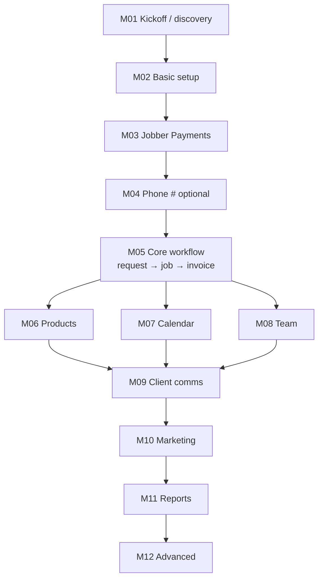

# OS Playbook, visual map (start here if you feel lost)

Open this file in **Preview** (Markdown preview in Cursor/VS Code) so diagrams render.

---

## The big picture (one sentence)

**You are building two things:** (1) **topic cards** that tell you *what to focus on* in training, and (2) **one log per business** so you remember *where you left off*, without replacing Jobber’s Help Center.

---

## Picture A, what lives where

```
Training Sherpa/
│
├── VISUAL-GUIDE.md          ← YOU ARE HERE (map + pictures)
├── README.md                 ← Short index + links
├── brief.md                  ← “What is this project?” in spec form
│
├── playbook/                 ← HOW TO THINK & CHOOSE ORDER
│   ├── how-to-use.md         ← Rules: one objective per 30 min, evidence, etc.
│   ├── routing.md            ← Persona + industry bucket → default path
│   └── module-template.md    ← Copy if you add a new topic card
│
├── modules/                  ← THE ACTUAL “LESSON PLANS” (M01–M12)
│   ├── 00-index.md           ← Table of contents for all modules
│   ├── M01-discovery-kickoff.md
│   ├── M02-basic-setup.md
│   └── … (through M12)
│
├── app/                      ← SIMPLE WEBSITE (tracker)
│   ├── README.md             ← How to run: npm install && npm run dev
│   └── …                     ← Lists journeys, SP basics, checkboxes for modules
│
└── journey-record/           ← ONE FILE PER BUSINESS (markdown alternative)
    ├── TEMPLATE.md           ← Copy → rename for each SP
    └── EXAMPLE.md            ← Fake example so the template makes sense
```

**Think of it like:**

| Folder | Analogy |
|--------|--------|
| `playbook/` | **Table of contents + rules** for the teacher |
| `modules/` | **Lesson plan per topic** (not a script) |
| `journey-record/` | **Gradebook / progress sheet** for each student (business) |
| `app/` | **Same idea as the journey log**, but in a **browser UI** (see `app/README.md`) |

---

## Picture B, one onboarding journey (flow)

```mermaid
flowchart LR
  subgraph you_prep["Before the call"]
    R[routing.md\npersona + bucket]
    M[modules/Mxx...\npick ONE topic]
    R --> M
  end

  subgraph call["During the call"]
    T[30 min:\nprimary objective]
  end

  subgraph after["After the call"]
    J[journey-record\nupdate log]
    E[Email SP:\nHelp Center search\nor your link list]
  end

  you_prep --> call --> after
```

You do **not** open every file every time. Typical day: **one module file** + **that SP’s journey file**.

---

## Picture C, default order of topics (simplified)



**You can skip or reorder**: the module cards say *skip if / compress if*.

---

## What to open first (3 clicks)

1. **`VISUAL-GUIDE.md`** (this file), orientation  
2. **`playbook/routing.md`**: see how persona + bucket steers the path  
3. **`modules/M05-core-workflow.md`**: example of what a “lesson plan” looks like  

Then open **`journey-record/TEMPLATE.md`** and imagine copying it for “ACME Plumbing.”

---

## If you only remember one thing

| I want to… | Open… |
|------------|--------|
| Know **what order** things usually go | `playbook/routing.md` |
| Know **what to teach this session** | `modules/Mxx-....md` (pick one) |
| Know **what we already did** for *this* SP | Your copy of `journey-record/TEMPLATE.md` |
| Know **when to compress or defer** (evidence gates) | `playbook/how-to-use.md` |

---

## Help Center (no panic)

Jobber’s site still has the **how-to clicks**. This folder is **what to prioritize and how to know you’re done**; not thousands of pasted URLs unless you choose to add a small link list later.

---

## Optional: the web app (`app/`)

If you prefer **a website** over markdown journey files: run the app locally (see **`app/README.md`**). It shows **all journeys**, lets you enter **SP basics**, and has a **learning plan** with **Complete / Skip** per module. **Data stays in your browser** until you export a JSON backup; there is no Jobber login or cloud sync in this version.
