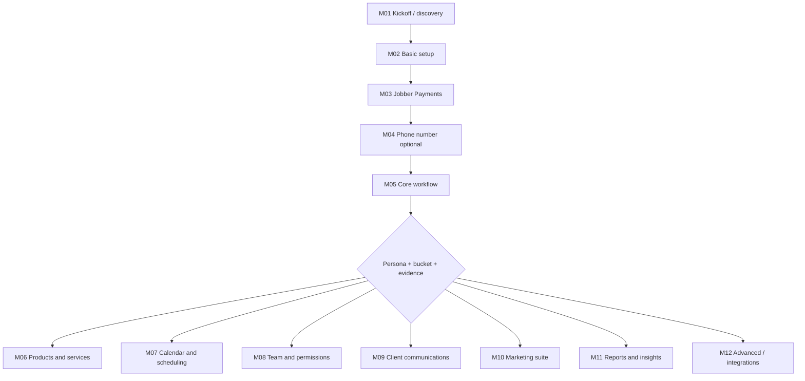

# Routing, persona × workflow bucket

Personas are **pressure profiles**. Workflow buckets are **how work actually flows**. Tag both on the journey record.

## Personas (quick reference)

| Persona | Stage | Optimize for |
|---------|--------|----------------|
| **Solo Sam** | Startup / survival | Time, burnout, owner adoption; smallest viable workflow |
| **Growing Gary** | Scaling / team | Repeatability, first hires, quality while delegating |
| **Professional Paula** | Expansion / optimization | Margin, schedule density, consistent CX across crews |
| **Enterprise Eric** | Maturity / multi-location | Data, integrations, governance, culture at scale |

**Blended reality:** Note secondary stress (e.g., “Gary + Sam-level owner workload”).

## Workflow buckets (Jobber-style)

| Bucket | Examples | Sequencing bias |
|--------|----------|-----------------|
| **Recurring outdoor** | Lawn, irrigation, pool, pest, snow | Recurring jobs, routes, visit schedules early |
| **Mechanical / emergency trades** | HVAC, plumbing, electrical, roofing, appliance | Dispatch, urgent requests, estimate → job speed |
| **Cleaning / facilities** | Residential/commercial clean, janitorial, pressure washing | High volume scheduling, Client Hub, appointments |
| **Construction / projects** | GC, paint, concrete, fencing | Estimates, job costing mindset, phases / larger jobs |
| **Niche services** | Detailing, locksmith, grooming, restoration | Flexible; confirm their actual job lifecycle first |

## Default path (all personas, adjust with module cards)

1. **M01** Discovery (KO)  
2. **M02** Basic setup (business, taxes)  
3. **M03** Jobber Payments  
4. **M04** Dedicated Phone Number *(optional, legal block common)*  
5. **M05** Core workflow (request → quote → job → invoice)  
6. Then **branch** by evidence and bucket (products, calendar, team, comms, marketing, reports…)

## Persona → emphasis (not a different syllabus)

| | Sam | Gary | Paula | Eric |
|---|-----|------|-------|------|
| **Tone** | Protect time; one habit at a time | Systems + delegation | Optimization + CX | Governance + reporting |
| **Team modules** | Defer until workflow real | **M08** sooner | **M08** + permissions depth | Roles, audit, multi-site patterns |
| **Marketing / GMB** | After workflow + 1 engagement signal | When repeatable ops exist | **Sooner** (fill schedule) | Brand + multi-territory |
| **Reports** | Light | When jobs are real | Utilization, margin | Dashboard culture |

## Routing flow (high level)

## Exception notes (document on journey record)

- **Invoicing elsewhere (e.g., corporate):** Success = job lifecycle + documentation in Jobber; compress **M05** invoice slice.  
- **Straight to job:** Skip quote-heavy depth; still align **requests → job → completion → money** to their language.  
- **Website / GBP lagging for Sam:** Not a blocker for workflow; may be **later** than for Paula.
